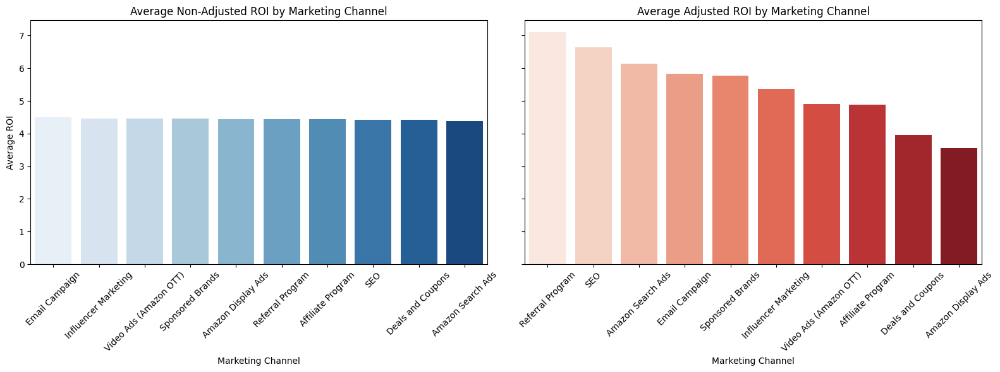
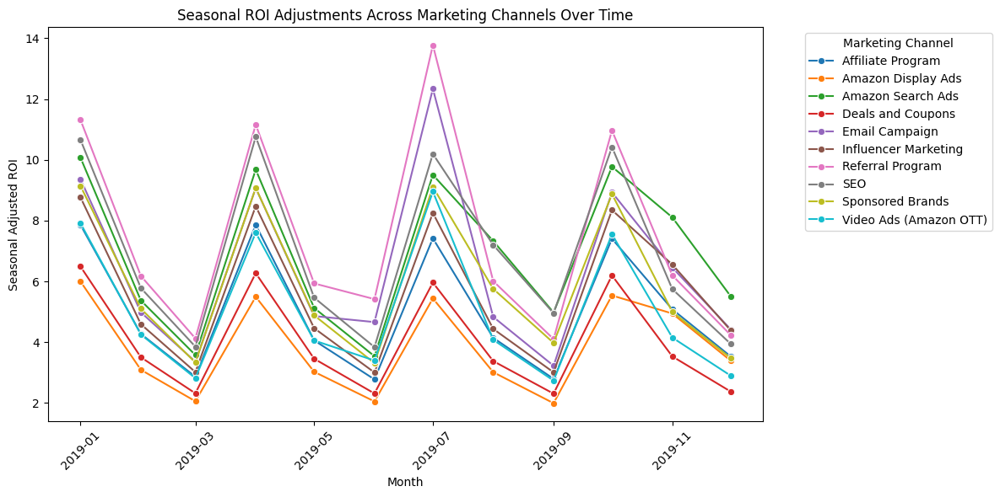
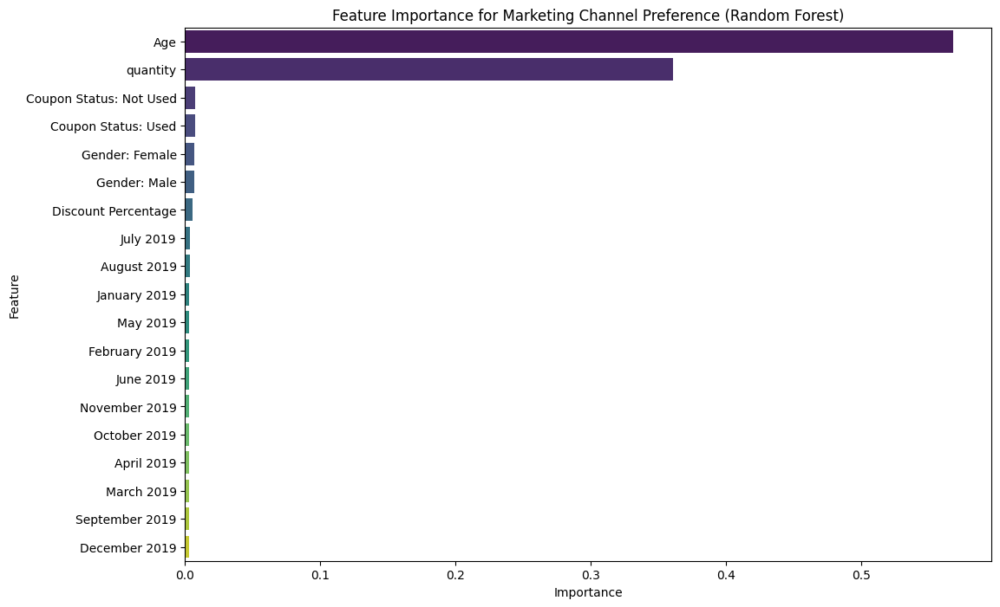
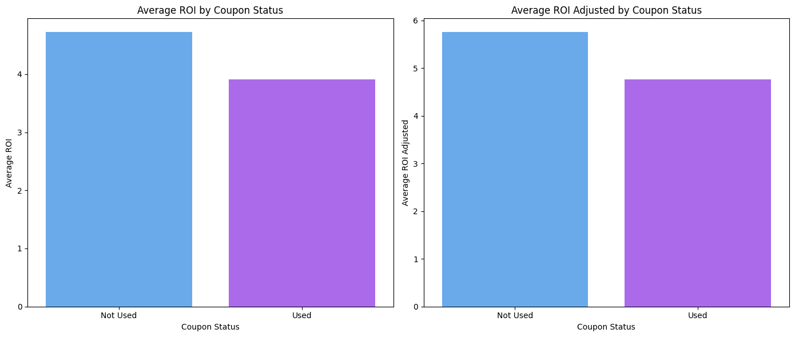
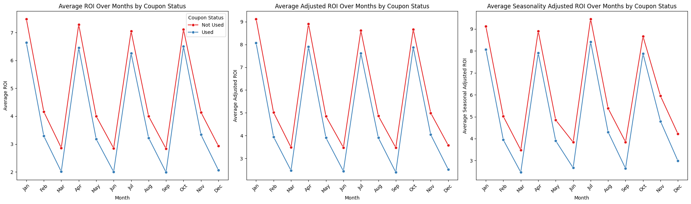
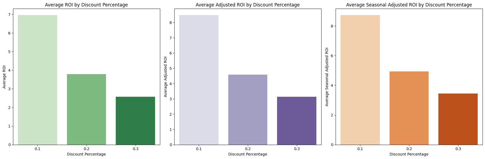

# What are the most effective marketing channels and campaigns?

## 1. Evaluate the ROI of different marketing channels

### Formulation and Data Manipulation
1. Revenue
- Formula: revenue = quantity * actual_price OR discounted price
- Explanation: Calculation of how much money was generated from sales. It multiplies the number of units sold (quantity) by the actual or discounted price of the product (actual price) depending on whether the coupons were used, giving us the total revenue from sales
2. Discounted Revenue
- Formula: discounted_revenue = quantity * discounted_price
- Explanation: This represents the revenue generated from the sale after applying any discounts. It multiplies the number of units sold by the discounted price of the product.
3. Discount Cost
- Formula: discount_cost = quantity * (actual_price - discounted_price)
- Explanation: The difference between the actual price and the discounted price represents the amount of money "lost" due to the discount, and it can be viewed as a marketing expense. When a product is discounted, it's essentially a form of marketing expenditure to entice customers to buy. Thus, the discount cost is calculated by multiplying the price difference by the number of units sold. This cost acts as a proxy for how much the company "spent" to attract customers through discounts. If the product were sold at full price, there would be no discount cost.
4. ROI
- Formula: ROI = revenue / (discount_cost + 1)
- Explanation: Typically, ROI measures the return generated on the money invested. In this case, we're treating the discount given as the "investment" (or cost) to generate revenue. Revenue is the "return" or gain. Discount Cost is treated as the "investment" or the marketing expenditure. The ROI formula includes +1 to avoiding division by zero, if a product was sold at full price (no discount), the discount_cost would be zero. In such cases, we don't want to divide by zero. The +1 prevents division by zero while keeping the calculation stable. It doesn't materially affect the outcome, as adding 1 to large values doesn't change the result significantly, but it ensures that we don't run into errors in cases of full-price sales. Hence, this proxy calculation for ROI is specifically focused on evaluating marketing effectiveness.

### Analysis of ROI across different marketing channels

Research:

Articles referenced: 
1. https://doi.org/10.54097/fbem.v7i3.5599
2. https://businessmodelanalyst.com/amazon-marketing-strategy/
3. https://ahrefs.com/blog/marketing-channels/
4. https://www.hubspot.com/marketing-statistics
5. https://blog.hubspot.com/marketing/marketing-channels 

Based on Amazon's typical marketing strategies, we could use the following channels:
- Amazon Search Ads – Amazon's own PPC advertising.
- Email Campaign – Targeted email promotions to engage customers.
- Affiliate Program – Partnerships with external websites and influencers to drive traffic.
- Amazon Display Ads – Banner ads within and outside the Amazon platform.
- SEO – Optimization for Amazon search and external search engines.
- Influencer Marketing – Collaborations with influencers, especially on social media platforms.
- Video Ads (Amazon OTT) – Video advertising on Amazon Fire TV and Twitch.
- Referral Program – Incentives for customers to refer others.
- Sponsored Brands – Ads that feature brands to enhance visibility on Amazon.
- Deals and Coupons – Promotional discounts offered on Amazon.

Justification for ROI Adjustment:

As Amazon’s channel effectiveness can vary significantly based on visibility, engagement rates, and cost efficiency, to adjust the synthetic data generation to better reflect Amazon’s actual marketing channels and realistic effectiveness, multipliers will be used in the ROI modelling based on the articles referenced. Multipliers can reflect the varying effectiveness of each marketing channel, as different channels inherently yield different returns (For example, Amazon Search Ads are often more effective than display ads). However, the synthetic generation of multipliers involves assumptions as we do not have specific performance data from Amazon.

- Amazon Search Ads: Multiplier of 1.4 as they provide high visibility to shoppers with intent to purchase.
- Email Campaign: Multiplier of 1.3 for targeted engagement, although less visible than search ads.
- Affiliate Program: Multiplier of 1.1 since it drives traffic from external sources with varying conversion rates.
- Amazon Display Ads: Multiplier of 0.8 because display ads tend to have lower engagement compared to direct search.
- SEO: Multiplier of 1.5 as organic visibility can yield long-term returns without additional spending.
- Influencer Marketing: Multiplier of 1.2 for brand awareness, effective in reaching wider audiences.
- Video Ads (Amazon OTT): Multiplier of 1.1 as video ads can engage audiences but vary in effectiveness.
- Referral Program: Multiplier of 1.6, as referral programs often yield high conversion rates from trusted recommendations.
- Sponsored Brands: Multiplier of 1.3, as these ads enhance brand presence and are highly visible on the platform.
- Deals and Coupons: Multiplier of 0.9, as discounts attract price-sensitive buyers but may not lead to loyal customers.

### Analysis of Seasonality Effects on ROI across Different Marketing Channels

Observation: 
1. The chart highlights a significant mid-year spike in ROI for most marketing channels, with Email Campaign and Referral Program being the top performers. This indicates that these channels might be leveraged more heavily during peak promotion periods like summer sales. This corresponds to the articles that were referenced. 
2. Cyclical nature of the graph shows that there are specific periods where demands surges and Amazon can look into further boosting demands during these periods and also look into investing more into effective marketing channels during periods that saw dips in ROI.
3. The downward trend after the holiday season at the end of the year suggests a potential reduction in marketing effectiveness in the early periods of the year, signaling the need for optimized strategies during that time. The early part of the year, while stable, may also benefit from targeted campaigns to boost ROI. This analysis can help in planning marketing strategies, optimizing campaign timing, and selecting the most effective channels to maximize ROI throughout the year.

### Random Forest Classifier for Analysis of Channel Preferences

Observation:
1. Age: Age significantly influences channel preference, showing that different demographics prefer different channels.
2. Quantity: Quantity is also an important feature. A higher quantity of items purchased could indicate high engagement with certain marketing channels (for example, bulk discounts might be promoted more on certain channels).
3. Coupon Status: Coupon usage has some impact but appears lower than age and quantity. This could mean that, while coupon usage impacts overall engagement, it might not be a strong predictor of specific channel preference.
4. Minimal influence of temporal and demographic features. 

## 2. Analyze the impact of various promotional campaigns on sales.

### Analysis of the Impact of Different Promotional Campaigns on Sales

Observation: While promotions may encourage purchases, they seem to lower the ROI. This could imply that although coupons boost sales volume, they may not be as profitable when ROI is taken into account. If the goal of Amazon is to maximize ROI, it might be beneficial to reconsider the scale or structure of coupon-based promotions. However, if the goal is more customer engagement or market share, promotions might still be justified despite a lower ROI. From the previous section, coupon usage has led to increased quantity purchased per transaction, which shows that coupon usage can promote more market share and customer loyalty.

### Analysis of Seasonality Usage of Coupons on Revenue

Observation: 
1. Higher ROI with No Coupon Usage: Across all three ROI metrics, the lines for "Not Used" consistently have higher values compared to "Used". This suggests that, on average, transactions where no coupon was used yielded a higher ROI. This might be due to the reduction in revenue associated with coupon discounts.
2. Impact of Adjusted ROI Metrics: Both the Adjusted ROI and Seasonally Adjusted ROI follow similar patterns to the unadjusted ROI, though they tend to have higher peaks. This suggests that when seasonality and specific marketing adjustments are factored in, the impact of promotional campaigns might be more favorable. The adjustments might help account for variations that impact baseline ROI.

Marketing Strategy:
1. During High ROI Periods: March, July, and October appear to be strong months in terms of ROI, suggesting these could be good months to leverage without relying heavily on discounts or coupons.
2. Coupon Strategy Adjustment: Since coupon usage correlates with lower ROI, it may be worth investigating the specific types or values of coupons used during these months to optimize for better returns.

### Analysis of Different Tiers of Discount on Sales

Observation:
1. ROI Decline with Higher Discounts: Across all three ROI metrics, the 10% discount consistently yields the highest ROI, followed by the 20% discount, and then the 30% discount. This pattern indicates that a smaller discount percentage is associated with higher profitability relative to costs. As discounts increase, the ROI metrics decline, which suggests that higher discounts may erode profitability without proportionately increasing the benefits or sales volume.
2. Price Sensitivity and ROI Impact: This trend could indicate that customers are not significantly more responsive to higher discounts as higher discounts do not result in enough additional sales to compensate for the lower per-unit profitability.

