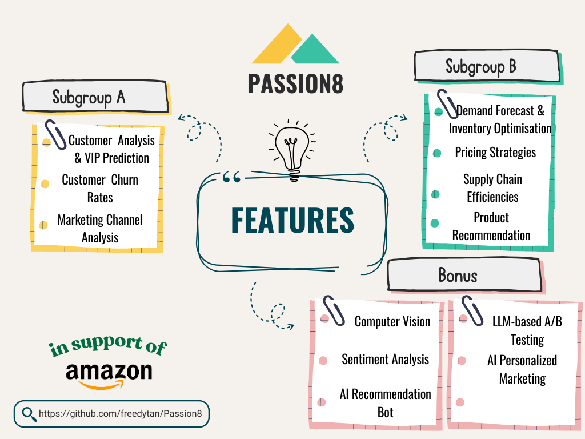

<div align="center">

# Passion8 <br> E-commerce Performance Analysis and Optimization

A data-driven framework leveraging AI and data analysis to optimize e-commerce operations. Built with end users in mind to improve customer experience and upscale business performance.

[Project Overview](#project-overview) |
[Set Up](#set-up) |
[Live Demo](#live-demo) |
[Usage Guidelines](#usage-guidelines) |
[Feedback](https://github.com/freedytan/Passion8/issues) |
[Wiki](https://github.com/freedytan/Passion8/)

[](https://www.python.org/downloads/release/python-3124/)
[](https://github.com/psf/black)
<a href="https://github.com/freedytan/Passion8" target="_blank">
</a>

</div>

## Project Overview



Passion8 is an comprehensive framework designed to enhance e-commerce platform performance by leveraging data analysis and artificial intelligence. This project provides a suite of analytical features aimed at optimizing key areas of e-commerce operations, from customer understanding to operational efficiency. Here’s a breakdown of each feature and its role in achieving a data-driven, scalable business model:

- **Customer Analysis & VIP Prediction**: Analyse sales and customer behavior patterns and support customer segmentation for potential VIPs prediction

- **Customer Churn Rates**: Calculate churn rates, identify at-risk customers, and assess current retention strategies to boost customer loyalty and value

- **Marketing Channel Analysis**: Evaluates the effectiveness of marketing channels to optimize ad spend

- **Demand Forecast & Inventory Optimisation**: Predicts future demand and optimise inventory management ensuring adequate stock without excess costs

- **Pricing Strategies**: Analyze price elasticity and create a dynamic pricing model that adjusts based on demand and market conditions to maximize revenue and competitiveness

- **Supply Chain Efficiencies**: Streamlines the supply chain to reduce costs and improve delivery times

- **Product Recommendation**: Traditional product recommendations to enhance the shopping experience using a hyrbid of collaborative and content-based filtering

- **Computer Vision**: Enables image-based product search and automatic categorisation for easier product discovery

- **Sentiment Analysis**: Analyzes customer reviews for insights into satisfaction and improvement areas

- **AI Recommendation Bot**: Retrieval Augmented Generation (RAG) based product recommendations to increase engagement

- **LLM-based A/B Testing**: Generates optimized content variations for testing and improved conversions

- **AI Personalized Marketing**: Uses AI to tailor marketing messages to individual customer preferences


With these features, Passion8 equips e-commerce businesses with the tools to make informed, data-driven decisions that enhance customer satisfaction, streamline operations, and drive business growth. This comprehensive approach to e-commerce optimization is designed with end-users in mind, focusing on improving experiences and scaling business performance.

## Set Up

### System Requirements
1. [Python](https://www.python.org/downloads/) >= 3.12.4
2. [Docker](https://www.docker.com/): optional, if you [install with Docker](#with-docker-recommended)

### With Docker (recommended)

Using Docker simplifies deployment by ensuring a consistent environment. Follow these steps to set up and run the project in a Docker container. 


```bash
docker-compose build
```

```bash
docker-compose up
```

Once everything is set up correctly, you can go to `http://localhost:8508/` to access the WebUI

### Without Docker

1. Clone the project repository to your local machine:

```bash
git clone https://github.com/freedytan/Passion8
cd Passion8
```

2. Create a Fresh Python Environment Set up a new Python environment to ensure that package dependencies don’t conflict with existing ones. Since our group has chosen to use `venv` for setting up Python environments, we will only include instructions for this method.

```bash
python -m venv .venv
source .venv/bin/activate  # On Windows, use `.venv\Scripts\activate`
```

3. Install required packages into your `venv`

```
pip install -r requirements.txt
```
Once setup is complete, proceed to the [Usage Guidelines](#usage-guidelines) for configuration and usage instructions.

## Live Demo

To Add

## Usage Guidelines

To fully utilize Passion8, complete the following configuration steps and learn how to navigate through the key features.

### 1. Configure Environment Variables
Before initializing the database, ensure the correct credentials and environment variables are set in the `.env` file located in the parent directory. Edit the file with the appropriate values:

```env
POSTGRES_PASSWORD = ''  # TOCHANGE
POSTGRES_PORT_NO = 5432 
POSTGRES_HOST = 'localhost'
POSTGRES_DB = 'dsa3101'
POSTGRES_USER = 'postgres'
H2O_API_KEY = ''  # TOCHANGE
H2O_PRODUCTS_COLLECTION_ID = ''  # TOCHANGE
```

### 2. Initialize the Database
To set up the database with the required tables and data:
1. Open the `db_init.ipynb` Jupyter notebook in the project directory.
2. Run all cells by selecting **Cell** > **Run All** to initialize the database.

### 3. Launch the Application
After configuring and initializing, start the application with Streamlit:

```bash
streamlit run Hello.py
```

This will start the application at a URL, typically http://localhost:8501, which you can open in your browser to access the interface.

### Key Features and Usage

- **Subgroup A - Customer Behavior and Sales Analysis**: Focuses on understanding customer behaviors to enhance engagement and loyalty, using features like customer analysis, churn rate prediction, and marketing channel effectiveness.

- **Subgroup B - Inventory Management and Pricing Optimization**: Concentrates on operational efficiency and profitability by forecasting demand, implementing pricing strategies, improving supply chain performance, and offering product recommendations.

- **Bonus - Advanced AI Features**: Implements AI tools to boost user experience and marketing impact, including computer vision for product search, sentiment analysis, a recommendation bot, A/B testing, and personalized marketing through AI.

### Additional Tips

- **Data Refresh**: Periodically rerun the database initialization script (`db_init.ipynb`) to refresh data and ensure up-to-date insights.

- **Troubleshooting**: If you encounter issues:
  - Verify that the `.env` file is correctly configured with valid credentials.
  - Ensure all dependencies are installed in the virtual environment.
  - Restart the Streamlit app by running `streamlit run Hello.py` if needed.

### Stopping the Application
To stop the Streamlit app, return to the terminal where it is running and press `CTRL + C`.

## Contributors
To add