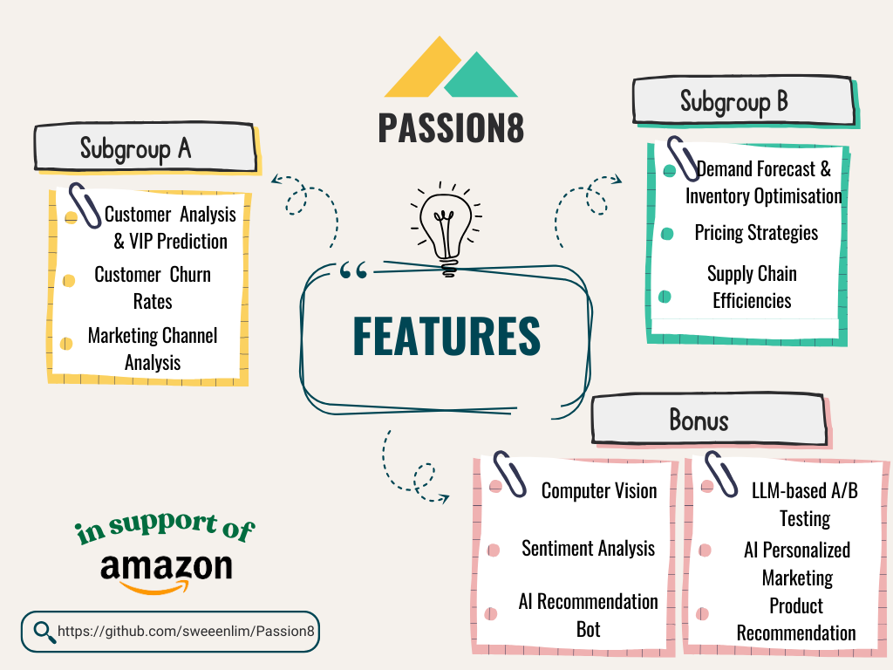

<div align="center">

# Passion8 <br> E-commerce Performance Analysis and Optimization

A data-driven framework leveraging AI and data analysis to optimize e-commerce operations. Built with end users in mind to improve customer experience and upscale bgit usiness performance.

[Project Overview](#project-overview) |
[Set Up](#set-up) |
[Live Demo](#live-demo) |
[Usage Guidelines](#usage-guidelines) |
[Feedback](https://github.com/sweeenlim/Passion8/issues)

[](https://www.python.org/downloads/release/python-3124/)
[](#option-1-using-docker-recommended)
[](https://github.com/sweeenlim/Passion8/wiki)


</div>

## Project Overview



Passion8 is an comprehensive framework designed to enhance e-commerce platform performance by leveraging data analysis and artificial intelligence. This project provides a suite of analytical features aimed at optimizing key areas of e-commerce operations, from customer understanding to operational efficiency. Here’s a breakdown of each feature and its role in achieving a data-driven, scalable business model:

- **Customer Analysis & VIP Prediction**: Analyse sales and customer behavior patterns and support customer segmentation for potential VIPs prediction

- **Customer Churn Rates**: Calculate churn rates, identify at-risk customers, and assess current retention strategies to boost customer loyalty and value

- **Marketing Channel Analysis**: Evaluates the effectiveness of marketing channels to optimize ad spend

- **Demand Forecast & Inventory Optimisation**: Predicts future demand and optimise inventory management ensuring adequate stock without excess costs

- **Pricing Strategies**: Analyze price elasticity and create a dynamic pricing model that adjusts based on demand and market conditions to maximize revenue and competitiveness

- **Supply Chain Efficiencies**: Streamlines the supply chain to reduce costs and improve delivery times

- **Product Recommendation**: Traditional product recommendations to enhance the shopping experience using a hyrbid of collaborative and content-based filtering

- **Computer Vision**: Enables image-based product search and automatic categorisation for easier product discovery

- **Sentiment Analysis**: Analyzes customer reviews for insights into satisfaction and improvement areas

- **AI Recommendation Bot**: Retrieval Augmented Generation (RAG) based product recommendations to increase engagement

- **LLM-based A/B Testing**: Generates optimized content variations for testing and improved conversions

- **AI Personalized Marketing**: Uses AI to tailor marketing messages to individual customer preferences


With these features, Passion8 equips e-commerce businesses with the tools to make informed, data-driven decisions that enhance customer satisfaction, streamline operations, and drive business growth. This comprehensive approach to e-commerce optimization is designed with end-users in mind, focusing on improving experiences and scaling business performance.

## Set Up

### System Requirements
1. [Python](https://www.python.org/downloads/) >= 3.12.4
2. [Docker](https://www.docker.com/): optional, if you [install with Docker](#option-1-using-docker-recommended)


# Project Setup Guide

This guide provides steps to clone the repository, configure environment variables, and set up the project either using Docker (recommended) or a local Python virtual environment.

## Step 1: Clone the Repository and Configure Environment Variables

### 1. Clone the Repository

Clone the project repository and navigate into the project directory:
```bash
git clone https://github.com/sweeenlim/Passion8
cd Passion8
```

### 2. Set Up the `.env` File

Use .env.example as a template to get you started. 

For the purpose of this project, please approach any of our friendly contributors to use our specific API keys if you are looking to run the project.

#### For Docker Setup (recommended)

If you are using Docker, you *only* need to add the H2O API key and product collection ID in the `.env` file. Create a `.env` file in the project’s root directory and add the following:
```env
H2O_API_KEY_CHATBOT= <your_h2o_api_key>
H2O_PRODUCTS_COLLECTION_ID= <your_collection_id>
H2O_API_KEY_EMAIL= <your_h2o_api_key>
```

#### For Local Setup

If you are setting up the project locally, include *both* the H2O API details and PostgreSQL credentials in the `.env` file. Here’s an example structure:
```env
H2O_API_KEY_CHATBOT= <your_h2o_api_key>
H2O_PRODUCTS_COLLECTION_ID= <your_collection_id>
H2O_API_KEY_EMAIL= <your_h2o_api_key>
POSTGRES_USER= 'postgres'
POSTGRES_PASSWORD= <your_postgres_password>
POSTGRES_DB= 'dsa3101'
POSTGRES_HOST= 'localhost'
POSTGRES_PORT= '5432'
```

## Step 2: Set Up the Project Environment

You can either use Docker (recommended for a consistent setup) or set up a local environment using `venv` as detailed below.

### Option 1: Using Docker (Recommended)

Docker provides a reliable, consistent environment for deployment. Follow these steps to build and launch the project in Docker containers:

1. **Build the Docker Image**
   ```bash
   docker-compose build
   ```

2. **Run the Docker Containers**
   ```bash
   docker-compose up
   ```

Once everything is set up, you should see logs confirming the services are running. To access the WebUI, open [http://localhost:8501](http://localhost:8501) in your browser.

---

### Option 2: Without Docker (Using a Virtual Environment)

If Docker isn’t available or preferred, you can set up the project locally using a Python virtual environment. Since our team has chosen `venv` for Python environments, here’s how to proceed:


1. **Create a New Python Environment**  
   Set up a new virtual environment to keep dependencies isolated:
   ```bash
   python -m venv .venv
   source .venv/bin/activate  # On Windows, use `.venv\Scripts\activate`
   ```

2. **Install Dependencies**  
   With the virtual environment activated, install the required packages:
   ```bash
   pip install -r requirements.txt
   ```

3. **Initialize the Database**
To set up the database with the required tables and data:
- Open the `db_init.ipynb` Jupyter notebook in the project directory.
- Run all cells by selecting **Cell** > **Run All** to initialize the database.

4. **Launch the Application**
Start the application with Streamlit at http://localhost:8501:

```bash
streamlit run Hello.py
```

## Next Steps

Once setup is complete, refer to the [Usage Guidelines](#usage-guidelines) for detailed instructions on configuration and usage.

This setup should provide a clean, ready-to-use environment for working with the project, either via Docker or locally.


## Live Demo

To Add

## Usage Guidelines

To fully utilize Passion8, complete the following configuration steps and learn how to navigate through the key features.

### Configure Environment Variables
Before running the project itself either with docker or locally, ensure that correct credentials and environment variables are set in the `.env` file located in the parent directory. We used H2o.ai which is an open-source (and free!) platform for us to access LLMs. 

To run this project and reproduce the best results, feel free to reach out to any of our passionate contributors to obtain our specific API keys.

### Key Features and Usage

- **Subgroup A - Customer Behavior and Sales Analysis**: Focuses on understanding customer behaviors to enhance engagement and loyalty, using features like customer analysis, churn rate prediction, and marketing channel effectiveness.

- **Subgroup B - Inventory Management and Pricing Optimization**: Concentrates on operational efficiency and profitability by forecasting demand, implementing pricing strategies, improving supply chain performance, and offering product recommendations.

- **Bonus - Advanced AI Features**: Implements AI tools to boost user experience and marketing impact, including computer vision for product search, sentiment analysis, a recommendation bot, A/B testing, and personalized marketing through AI.

### Additional Tips

- **Data Refresh**: Periodically rerun the database initialization script (`db_init.ipynb`) to refresh data and ensure up-to-date insights.

- **Troubleshooting**: If you encounter issues:
  - Verify that the `.env` file is correctly configured with valid credentials.
  - Ensure all dependencies are installed in the virtual environment.
  - Restart the Streamlit app by running `streamlit run Hello.py` if needed.

### Stopping the Application
To stop the Streamlit app, return to the terminal where it is running and press `CTRL + C`.

## Contributors

